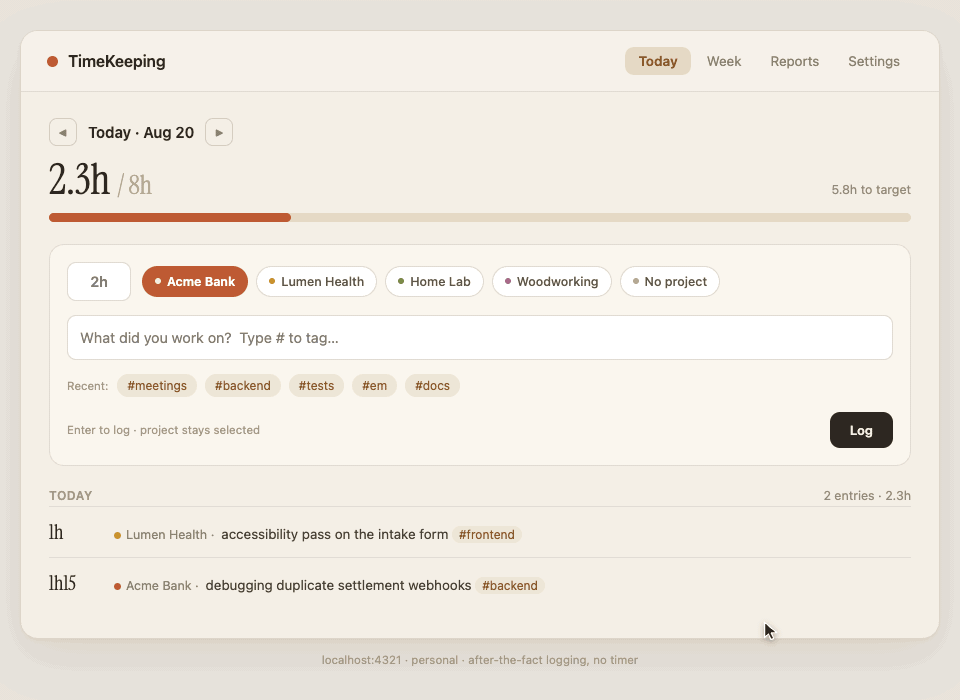
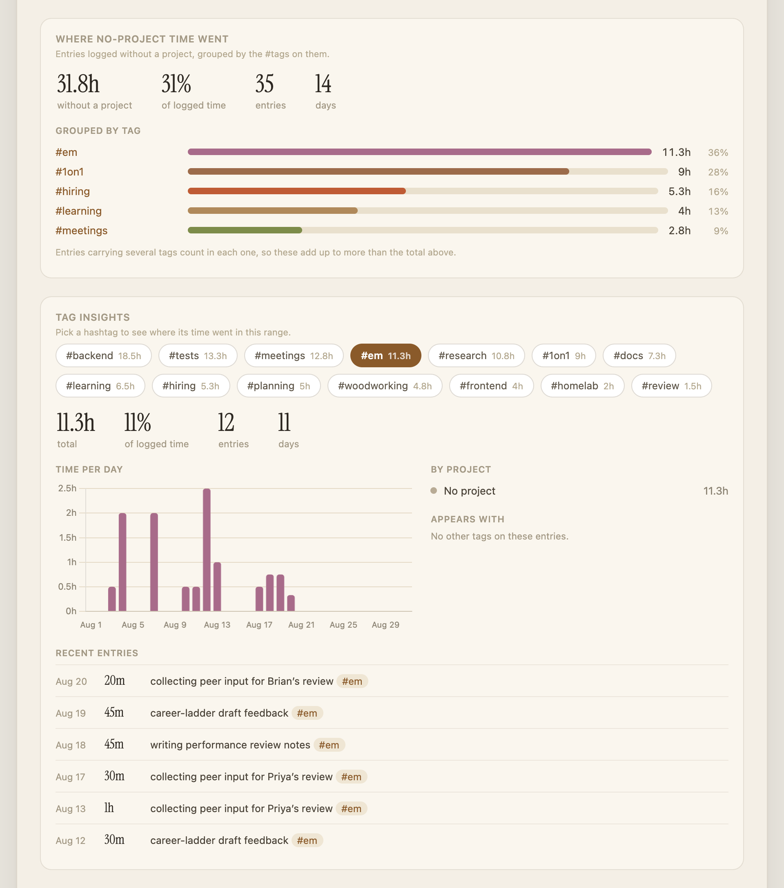
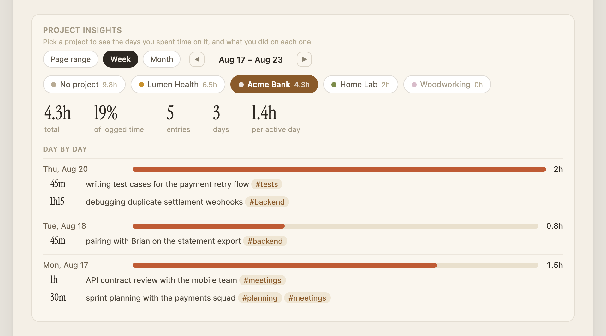
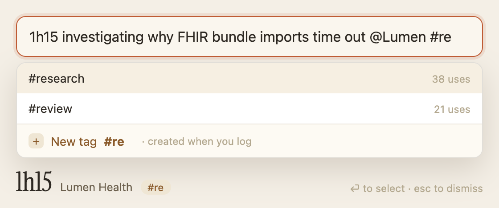

# TimeKeeping

A calm, personal time tracker for people who don't want to run a timer.



At the end of a stretch of work — or the end of the day — you write down what
you did and how long it took: `45m writing test cases for the payment retry
flow #tests`. That's the whole workflow. TimeKeeping turns those little notes
into a clear picture of where your days, months, and years actually go.

It runs entirely on your own machine as a small local web app
([http://localhost:4321](http://localhost:4321)). Your data lives in a SQLite
file in the project folder. Nothing is sent anywhere unless you opt into the
Google Sheets backup.

## How it works

- **Log after the fact.** Type a duration (`2h`, `90m`, `1h30`) and a
  description. Hit Enter. No timer to start, forget about, and feel guilty over.
- **Projects** group work for a client or initiative — pick one with a click
  (or don't; "No project" is fine for life admin, learning, meetings).
- **`#tags` live inside the description.** Write `sprint planning #meetings`
  and the tag exists from then on — no tag management screen, and one entry can
  carry several tags. Typing `#` suggests the tags you already use, and offers
  to create the one you're typing.
- **A daily target** (default 8h) gives you the "5.1h of 8h" progress bar and
  powers the untracked-time report, so you can see which days quietly
  evaporated.


## The week at a glance

The **Week** view shows the shape of your week — which days hit target, which
day got away from you — and lets you click any day to backfill it.
Friday-afternoon-catching-up-on-Tuesday is a first-class workflow:


## Where did the time go?

The **Reports** tab answers that at whatever zoom level you're wondering about
— this week, this month, the last 12 weeks, or any custom range (a whole year,
if you like):


- **Time by project** — how the month split across clients and everything else.
- **Time by tag** — what *kind* of work it was: meetings, deep work, learning.
- **Tags within project** — what you actually did inside each project.
- **Weekly trend** — your rhythm over the last quarter.

### The hours that belong to no project

Meetings, 1:1s, reviews, reading — the work that never lands on a client's
line. **Where no-project time went** groups it by the tags you put on it, and
**Tag insights** takes any single hashtag and shows where it went: how much,
what share of your time, which projects, which tags it travels with, and the
entries themselves.



### One project, day by day

**Project insights** does the same for a project: the days you touched it and
what you did on each one. It can follow the range chips at the top of the page,
or step through week by week and month by month on its own — useful when you
need to reconstruct a month for an invoice.



### Zooming out

Pick **Last 12 weeks** (or a custom range) and the same panels cover a quarter
— crunches, quiet weeks, holidays. **Untracked time**, at the bottom of the
page, lists the workdays that fell short of target. Honest, slightly
confronting, very useful.


*The tour and every screenshot here show demo data — generate your own
playground with `npm run seed`.*

## Getting started

You need [Node.js](https://nodejs.org) 22.5 or newer (the built-in SQLite
support arrived there — no other database or native dependencies required).

```bash
npm install
npm start          # → http://localhost:4321
```

Add your projects in **Settings**, then start logging in **Today**.

Want to try it with fake data first?

```bash
npm run seed       # wipes data, loads ~14 weeks of demo entries
```

**Careful:** `seed` wipes entries, projects and tags — never run it once you
have real data. To go from demo data to a clean slate: stop the server, delete
`data/timekeeping.db*`, start again.

## Keep it running (macOS)

So the app (and its reminders) are always there without a terminal window:

```bash
bash scripts/install-launchd.sh    # starts now + at every login, restarts on crash
bash scripts/uninstall-launchd.sh  # removes it
```

Logs go to `~/Library/Logs/TimeKeeping/` (launchd can't write inside
`~/Documents`, which macOS protects).

## Menu bar quick logging (macOS)

Logging shouldn't mean hunting for a browser window. TimeKeeping can sit in the
macOS status bar — the icon area on the right — showing today's total, in the
accent colour while a workday is still short of target. Behind it is a small
window with one field, where the whole entry goes on a single line:



Typing `#` suggests your existing tags and offers to create the one you're
typing; `@` suggests projects. The corner previews exactly what will be
recorded. **⏎** takes the highlighted suggestion while the list is up and logs
the entry when it isn't; **esc** closes the window.

```bash
brew install --cask swiftbar
bash scripts/install-swiftbar.sh    # and uninstall-swiftbar.sh to remove
```

Setup notes and the full syntax: [`menubar/README.md`](menubar/README.md).

The parsing all happens server-side (`POST /api/quick`), so the menu bar is
just one way in — a Shortcut, or a plain `curl`, logs time just as well:

```bash
curl --data-urlencode "text=1:30 refactor the billing table #frontend" \
  localhost:4321/api/quick
```

## Reminders

If a workday is looking under-logged, TimeKeeping sends a macOS notification
at midday and end of day — a gentle nudge, not an alarm. The first one triggers
a permission prompt (attributed to Script Editor/osascript); allow it in
System Settings → Notifications if you miss it. Test with:

```bash
curl -X POST localhost:4321/api/dev/notify
```

## Google Sheets backup (optional)

A one-way live mirror of your data into a Google Sheet — useful as an
off-machine backup or for building your own pivot tables. The sheet is
disposable: SQLite stays the source of truth, and every sync is a full
rewrite, so edits or deletions in the sheet are simply overwritten. It syncs
60 seconds after any change, on startup, and hourly; failures retry with
backoff and never block the app.

One-time setup:

1. Create a Google Cloud project at [console.cloud.google.com](https://console.cloud.google.com) (free).
2. **APIs & Services → Library** → enable **Google Sheets API**.
3. **APIs & Services → Credentials → Create credentials → Service account.**
   Any name; no roles needed. Then open it → **Keys → Add key → JSON**.
4. Save the downloaded file as `data/service-account.json`, then
   `chmod 600 data/service-account.json`.
5. Create a Google Sheet and share it (Editor) with the service-account
   email — shown in **Settings → Google Sheets backup** once the JSON is in
   place.
6. Copy the sheet's ID (the long string in its URL) into **Settings →
   Sheet ID** and hit **Sync now**.

## Your data

Everything lives in `data/timekeeping.db` — one SQLite file you can copy,
back up, or query directly. No accounts, no cloud, no telemetry. The server
binds to `127.0.0.1` only, so nothing on your network can reach it.
