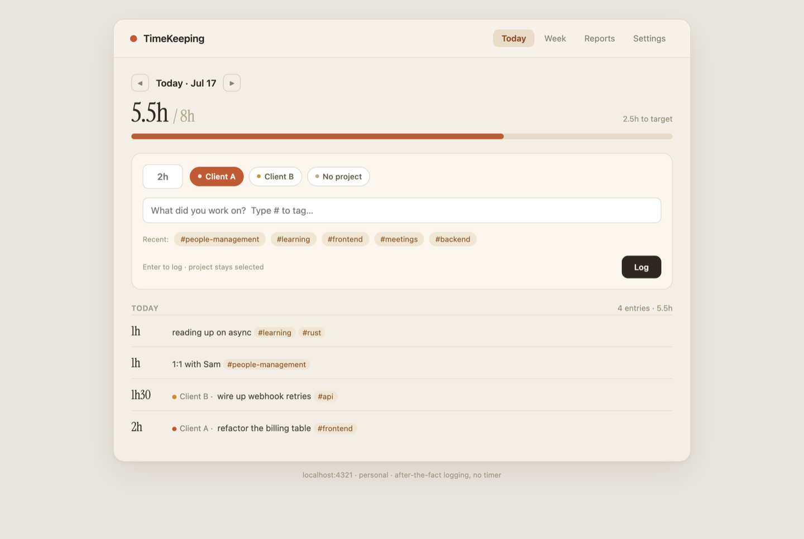
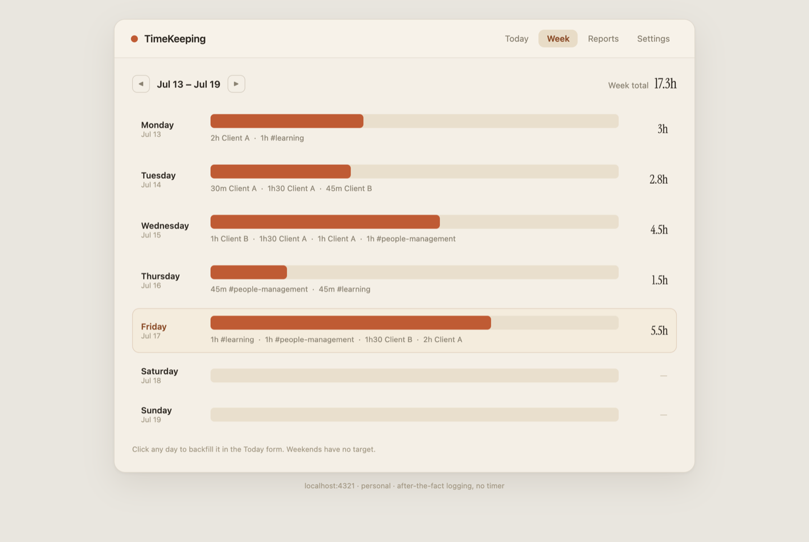
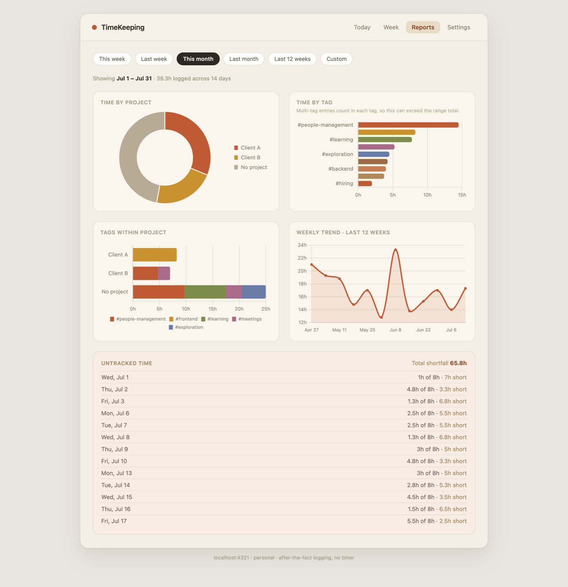
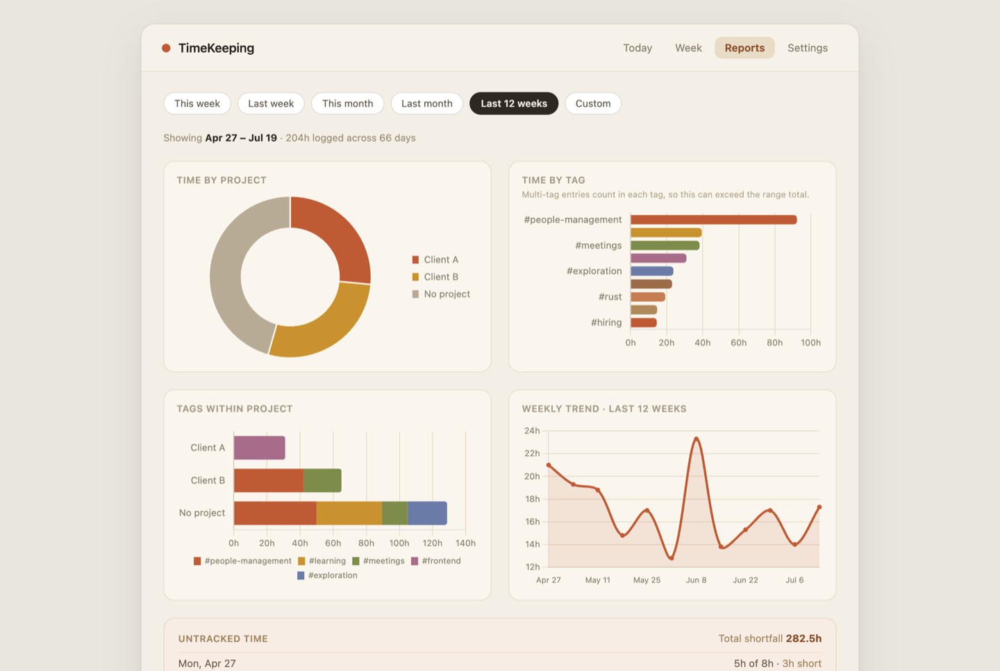

# TimeKeeping

A calm, personal time tracker for people who don't want to run a timer.

At the end of a stretch of work — or the end of the day — you write down what
you did and how long it took: `2h refactor the billing table #frontend`. That's
the whole workflow. TimeKeeping turns those little notes into a clear picture
of where your days, months, and years actually go.

It runs entirely on your own machine as a small local web app
([http://localhost:4321](http://localhost:4321)). Your data lives in a SQLite
file in the project folder. Nothing is sent anywhere unless you opt into the
Google Sheets backup.



## How it works

- **Log after the fact.** Type a duration (`2h`, `90m`, `1h30`) and a
  description. Hit Enter. No timer to start, forget about, and feel guilty over.
- **Projects** group work for a client or initiative — pick one with a click
  (or don't; "No project" is fine for life admin, learning, meetings).
- **`#tags` live inside the description.** Write `sprint planning #meetings`
  and the tag exists from then on — no tag management screen, and one entry can
  carry several tags.
- **A daily target** (default 8h) gives you the "5.5h of 8h" progress bar and
  powers the untracked-time report, so you can see which days quietly
  evaporated.

The **Week** view shows the shape of your week at a glance, and lets you click
any day to backfill it — Friday-afternoon-catching-up-on-Tuesday is a
first-class workflow:



## Where did the time go?

The **Reports** tab answers the question at whatever zoom level you're
wondering about — this week, this month, the last 12 weeks, or any custom
range (a whole year, if you like):



- **Time by project** — how the month split across clients and everything else.
- **Time by tag** — what *kind* of work it was: meetings, deep work, learning.
- **Tags within project** — what you actually did inside each project.
- **Untracked time** — day by day, how far short of target you landed. Honest,
  slightly confronting, very useful.

Zoom out to **Last 12 weeks** (or a custom range) and the weekly trend shows
your rhythm over a quarter — crunches, quiet weeks, holidays:



*All screenshots show demo data — generate your own playground with
`npm run seed`.*

## Getting started

You need [Node.js](https://nodejs.org) 22.5 or newer (the built-in SQLite
support arrived there — no other database or native dependencies required).

```bash
npm install
npm start          # → http://localhost:4321
```

Add your projects in **Settings**, then start logging in **Today**.

Want to try it with fake data first?

```bash
npm run seed       # wipes data, loads ~3 months of demo entries
```

**Careful:** `seed` wipes entries and projects — never run it once you have
real data. To go from demo data to a clean slate: stop the server, delete
`data/timekeeping.db*`, start again.

## Keep it running (macOS)

So the app (and its reminders) are always there without a terminal window:

```bash
bash scripts/install-launchd.sh    # starts now + at every login, restarts on crash
bash scripts/uninstall-launchd.sh  # removes it
```

Logs go to `~/Library/Logs/TimeKeeping/` (launchd can't write inside
`~/Documents`, which macOS protects).

## Reminders

If a workday is looking under-logged, TimeKeeping sends a macOS notification
at midday and end of day — a gentle nudge, not an alarm. The first one triggers
a permission prompt (attributed to Script Editor/osascript); allow it in
System Settings → Notifications if you miss it. Test with:

```bash
curl -X POST localhost:4321/api/dev/notify
```

## Google Sheets backup (optional)

A one-way live mirror of your data into a Google Sheet — useful as an
off-machine backup or for building your own pivot tables. The sheet is
disposable: SQLite stays the source of truth, and every sync is a full
rewrite, so edits or deletions in the sheet are simply overwritten. It syncs
60 seconds after any change, on startup, and hourly; failures retry with
backoff and never block the app.

One-time setup:

1. Create a Google Cloud project at [console.cloud.google.com](https://console.cloud.google.com) (free).
2. **APIs & Services → Library** → enable **Google Sheets API**.
3. **APIs & Services → Credentials → Create credentials → Service account.**
   Any name; no roles needed. Then open it → **Keys → Add key → JSON**.
4. Save the downloaded file as `data/service-account.json`, then
   `chmod 600 data/service-account.json`.
5. Create a Google Sheet and share it (Editor) with the service-account
   email — shown in **Settings → Google Sheets backup** once the JSON is in
   place.
6. Copy the sheet's ID (the long string in its URL) into **Settings →
   Sheet ID** and hit **Sync now**.

## Your data

Everything lives in `data/timekeeping.db` — one SQLite file you can copy,
back up, or query directly. No accounts, no cloud, no telemetry. The server
binds to `127.0.0.1` only, so nothing on your network can reach it.
